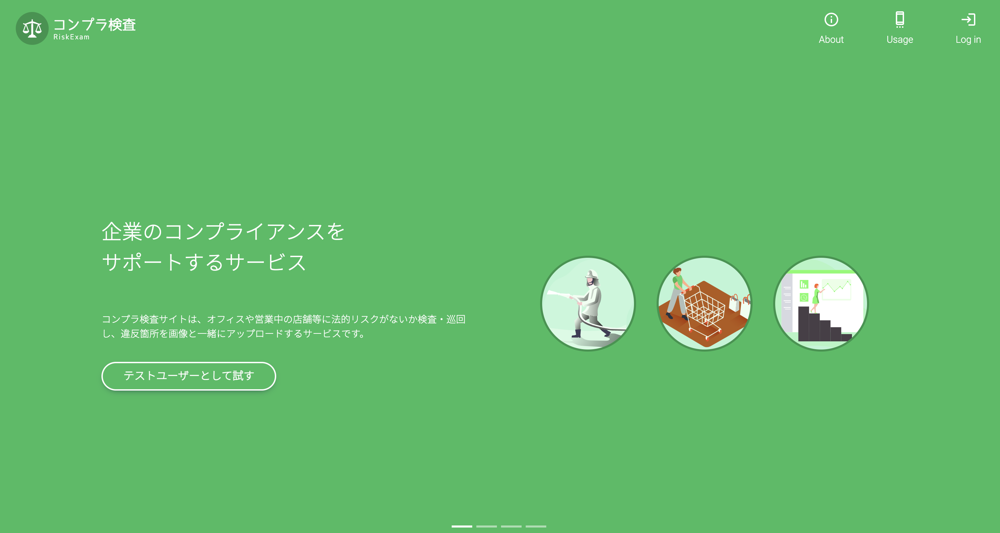
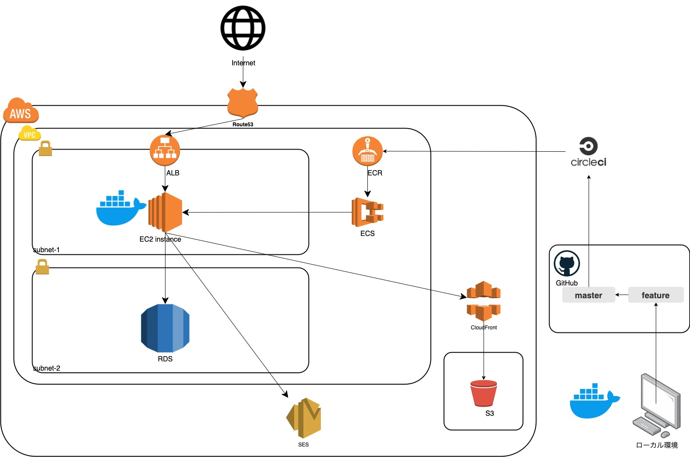

# コンプラ検査サイト

架空の企業内における```内部監査```を想定したシステムです。  
自社内の商業施設や店舗などが法令や社内ルールを遵守しているかを抜き打ち検査し、 **```違反箇所```** を検査結果としてアップロードしていきます。  
検査結果は、毎月```検査項目別```、```支社別```、```店舗別```などの観点から集計、グラフ化されます。



# リンク

- サイトリンク：https://exam.kensa-system.net

#「テストユーザーとして試す」

- テストユーザーとしてログインのうえ、疑似の検査メンバーとしてサイト内のサービスをご精査いただけます

# 制作目的

前作の[士業マッチングサイト](https://github.com/rk1quol/ShigyoMatch.git) の学習内容の続編として、

- Terraform を使用したインフラのコード化
- TypeScript を使った型安全なフロントエンドコーディングの基礎
- Nuxt.js を使ったSSRの学習

などの学習が主な目的です。

# 使用技術

- PHP 7.3
- Laravel 7.30
- Node.js 14.6
- nuxt/types 2.14
- SCSS
- MySQL 5.7.29
- Nginx 1.15
- AWS
  - VPC
  - ECS/ECR
  - EC2/ALB
  - RDS for MySQL
  - S3
  - CloudFront
  - Route53
  - ACM
- Docker
- CircleCI
  - ecs-deploy
- GitHub
- Terraform
- 主な UI ライブラリ：CoreUI、V-calendar
- 参考にした UI: Material Dashboard

# クラウドアーキテクチャ



CircleCI から ECR に push したイメージを、ECS の EC2 インスタンスタイプでデプロイしています。
web サーバーに Nginx を使い、ALB でリクエストの分配を行っています。

S3 と CloudFront を使った assets その他画像ファイルの CDN 配信も行っております。

# 開発環境

- MacBookPro
- Docker for Mac
- Git

docker-compose で Nginx、Laravel、MySQL を起動し、Volume をマウントしております。

# 機能一覧

- 認証機能（ログイン、ログアウト）
- テストログイン
- 違反箇所の投稿、削除、一覧表示、詳細表示
- 違反箇所一覧の並び替え、絞り込み機能
- 違反箇所のブックマーク機能
- ページング機能
- 画像アップロード機能（プロフィール画像、違反箇所サムネイル）
- ダッシュボード（Todo 一覧、スケジュールカレンダー、本日のみんなの予定等）
- スケジュールの登録・編集・削除機能
- スケジュールの共有・編集権限者の設定機能
- Todo の登録、完了済み設定、削除機能
- 検査結果のグラフ描画集計機能（月別、検査項目別、支社別等）

# アピールポイント

- Nuxt.jsを使用し、SSRによるサイト構築に挑戦したこと
- TypeScriptを取り入れ、型安全なフロントエンドに挑戦したこと
- Terraformを使ったインフラのコード化に挑戦したこと
- chart.jsをベースにしたライブラリを使い、APIに応じて動的なグラフ描画に挑戦したこと

# 今後の課題

- 次回は学習の成果物としてではなく、サービスとして運用する前提で何か作ってみたいです
- UIをゼロベースで考えるのに時間がかかってしまいました。今後は自分でSCSSを書くよりも、洗練されたCSSフレームワークに依存したほうが効率的かつ一貫したUIを実現できると思います
